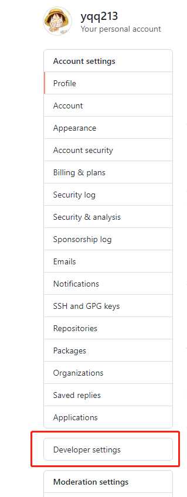
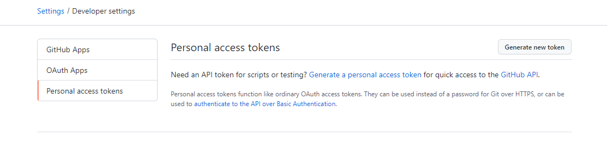
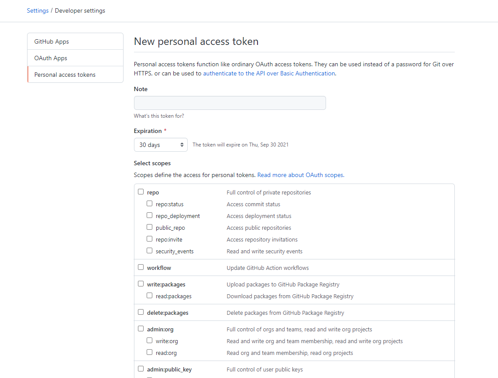
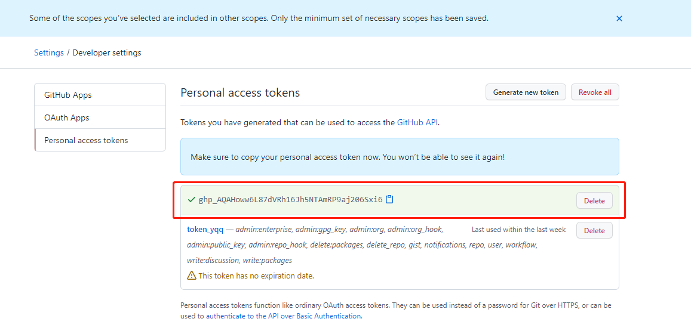

# 前言

前几天正准备往github上提交代码时，直接push失败，而且无法拉取代码，然而之前还是好好的，后来查看git日志后发现报了这个错

这个错误的意思是说自从2021年8月13日起，github便不再支持密码验证了，要使用个人token来进行验证，那么如何来解决这个问题呢

# 解决办法

既然官方说了必须要使用token验证，那么我们就去github官网去申请token，申请的步骤依次如下截图：

1、点击头像里的Settings，选择右侧的Developer settings

  

 

2、选择Personal access tokens，可以看到目前还没有申请任何可用的token

 

3、点击Generate new token按钮去申请新的token，将生成好的token保存下来

 

 

4、下次提交代码时输入对应的token即可，这里我用的是vscode插件git提交的，提交时输入你的github用户名，密码用刚才保存的token，完成后就能正常提交代码了，拉取也没问题

 

# 补充

如果上述操作不行，可以尝试删除之前电脑存储的github密码凭证，重新输入token验证，具体操作如下：

打开控制面板 → 用户账户 → 凭证管理器 → 管理windows凭证， 删除github那条凭据，下次提交时就会重新输入

 

------

***done！***

