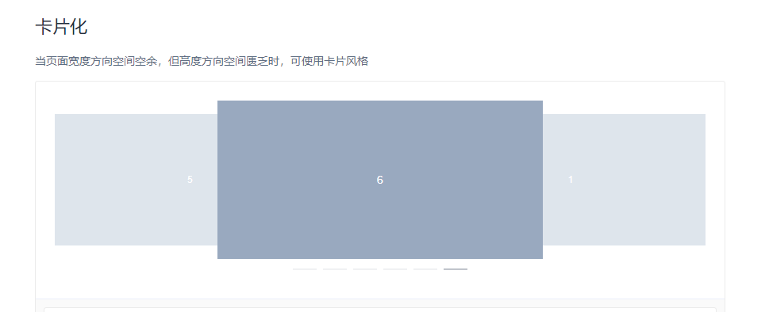
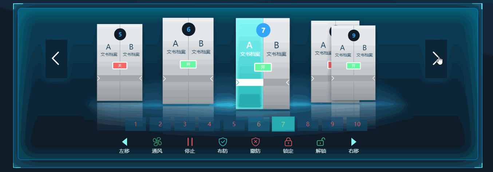
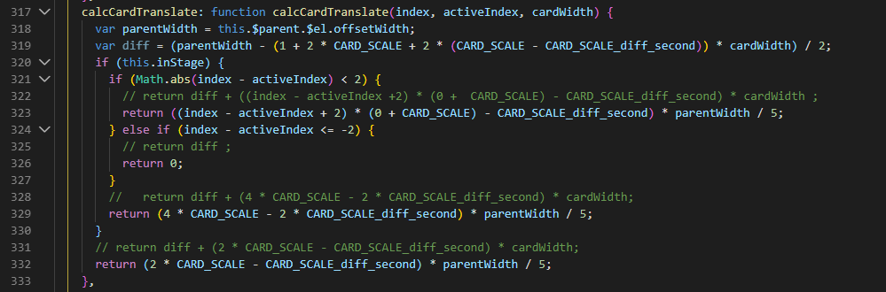

# 业务场景

在实际开发项目中，我们可能会遇到很多ui组件库满足不了的场景，比如前段时间公司ui给了个高保真页面，页面长这样：


<br>

看到中间那个卡片轮播区域，本着省时省力的原则，先去找了各ui框架的走马灯组件以及swiper插件，发现他们都只支持展示三个元素，不支持同时展示五个元素。基本是这样的：



<br>

因此，要实现这个效果，要么手动撸一个支持5个元素的卡片走马灯，要么改一下框架里走马灯组件的源码。在看了组件的源码后，又考虑到时间的原因，决定对源码稍加改动。。。


# 效果预览

OK，先上最终改动后的测试效果预览，此时便是实现支持五个元素的走马灯



<br>

# 源码实现

相关改动的文件只涉及到**carousel-item.js**，文件的位置是： ***/node_modules/element-ui/lib/carousel-item.js***

<br>

在line：278行，修改切换时card的缩放比例**CARD_SCALE**为0.9，增加一个变量**CARD_SCALE_diff_second**，表示中心card与每一个相邻card缩放差值

```javascript
var CARD_SCALE = 0.9;
var CARD_SCALE_diff_second = 0.1;
```

在line：330行，**translateItem**方法中，修改同时展示几个元素的判断方法。

将card宽度传给**calcCardTranslate**方法，并根据卡片索引值计算当前card的缩放比例

```javascript
this.inStage = Math.round(Math.abs(index - activeIndex)) < 3;
```

```javascript
var cardWidth = this.$el.offsetWidth;
this.translate = this.calcCardTranslate(index, activeIndex, cardWidth);
this.scale = this.active ? 1 : Math.abs(index - activeIndex) >= 2 ? CARD_SCALE - CARD_SCALE_diff_second : CARD_SCALE;
```

在line：316行，**calcCardTranslate**方法中，计算每次切换card时要移动的距离（注释的部分是没改之前的代码）



<br>

<br>

完整的**carousel-item.js**

[文件]: 

